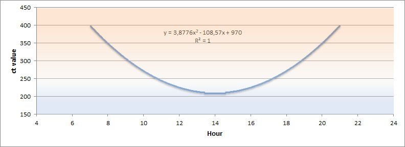

# node-red-contrib-hue-tunable-white
Node-RED node automatic change white color temperature of lights as the day progress.

A tiny script just to give you a feeling of varying daylight. It's used to increase mental health for people, in this modern world, spending too much time inside. 

## What is tunable white
*Aliases: 'tunable white', 'dynamic white', 'tunable dynamic white', 'kelvin changing'*

Its the possibility to change the 'color' of the white light according to the colors of the sun **automatically**. From the light orange shine at the morning and evening to the blueish light at midday. Basically to simulate daylight even if you don't go outside or during winter when daylight is scares.

## Usage
Give the node an input every so often to make it do its thing. Eg. every 15 minutes seams to work good. Also i recommend sending a ``msg.reset`` once a day, eg. at night, to overrule any manually changed lights back to having its color temperature automated.

### To get easy started
In Node-RED editor, click menu at top right corner -> Import -> Examples -> node-red-contrib-hue-tunable-white -> basic.

# How it works
At first run all lights are controlled to the right color temperature for the current time. Once this first run is completed the node will do a more careful update of the color temperature.
It will only change the color if the lights currently has the default startup color temperature or has the value has this node specified last. This means you can still change you lights and this node will respect that you manually took control of the light. If you turn your lights on and off from the mains this is also handled just fine if you lights startup with its standard value.

## Calculating the color
The node will use system time of the server to do a calculation of the color. A caveat to only relying on time is the color does not follow the real state of the sun at your location, as I found it more usable to control the light according to a fix schema.

So this is how its calculated:
At 6:00 and again at 22:00 the color will be the most orange. At 14:00 the color will be white-blueish.

The graph below shows how the color will change according to the current hour.

# Requirements
Requires a Hue Bridge and for you to grab a API key from it:
[Official guide to getting the API key (aka. *username*)](https://developers.meethue.com/develop/get-started-2/)

## Supported devices
Tested with these lights:
* Philips hue white ambiance
* Philips hue color
* Osram LIGHTIFY

*Not tested with lights that only does dimming, as I don't got access to any*